# tayeh-ui
[](https://ops.pchas.ir/job/tayeh-ui/)
[](https://www.npmjs.org/package/tayeh-ui)


  

<!-- <p align="center">

<b>

<a href="https://github.com/waynecz/Holmes">Holmes: Server boilerplate you might need</a>

|

<a href="https://github.com/waynecz/vue-img-inputer">Place other links here</a>

</b>

</p> -->

  

<br>

  

## Goals

  

- stay lightweight

- keep it simple

- be extendable

- become theme compatible

  

<br>

  

## Install and Usage

  

```bash

# installing package

npm install --save tayeh-ui

```

  

#### in your Vue main.js file

  

```js

import  Vue  from  'vue';

import  App  from  './App'

import  TayehUi  from  'tayeh-ui'

  

Vue.use(TayehUi)

  

new  Vue({

el: '#app',

render: h  =>  h(App)

})

  
```

  

<br>

## Examples 
You can checkout examples by running  

```js
// running examples
npm run dev
``` 

## Screenshots 
#### Inputs
```html
    <ty-input v-model="model" placeholder="لطفا نام را وارد کنید"></ty-input>
    <ty-input-number v-model="model" label="نام"></ty-input-number>
    <ty-currency-input v-model="model"></ty-currency-input>
```
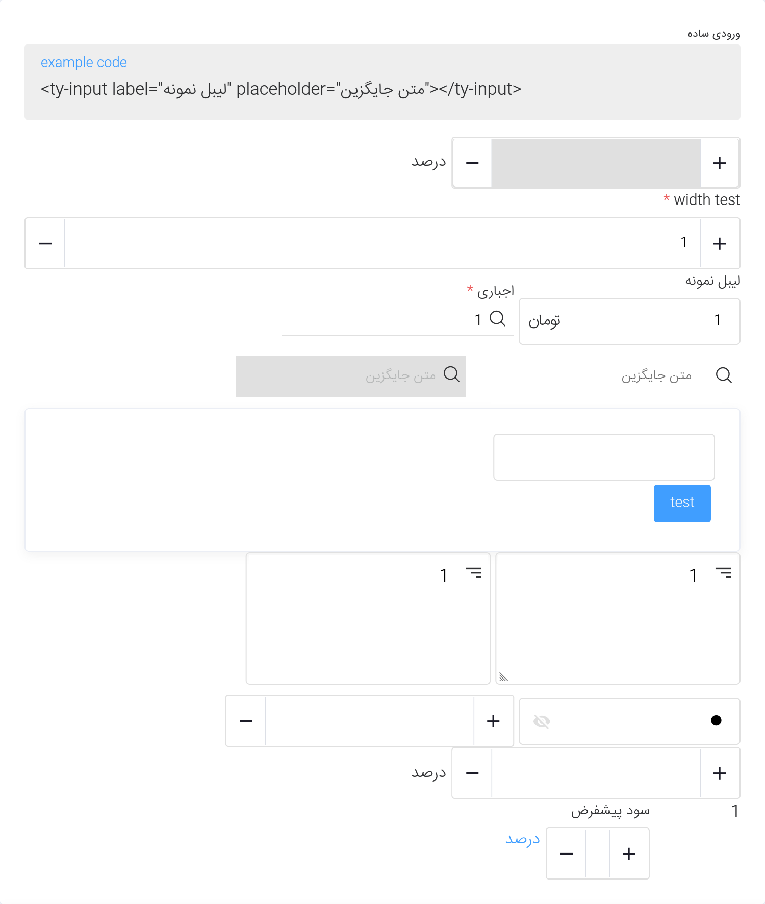
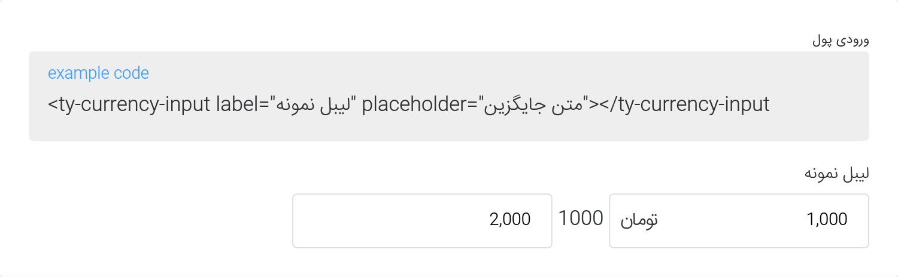
#### Icons
```html
    <i class="ty-icon ty-icon-heart"></i>
    <ty-button icon="heart"></ty-button>
```
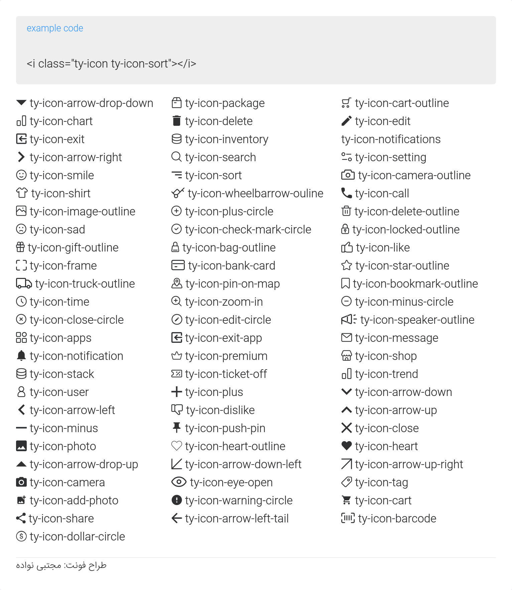
#### Buttons
```html
    <ty-button @click="clickHandler">Click Here</ty-button>
    <ty-button color="secondary">Click Here</ty-button>
    <ty-button size="small">Click Here</ty-button>
```
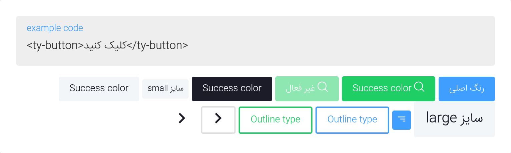
#### Card
```html
    <ty-card>Card Content</ty-card>
```
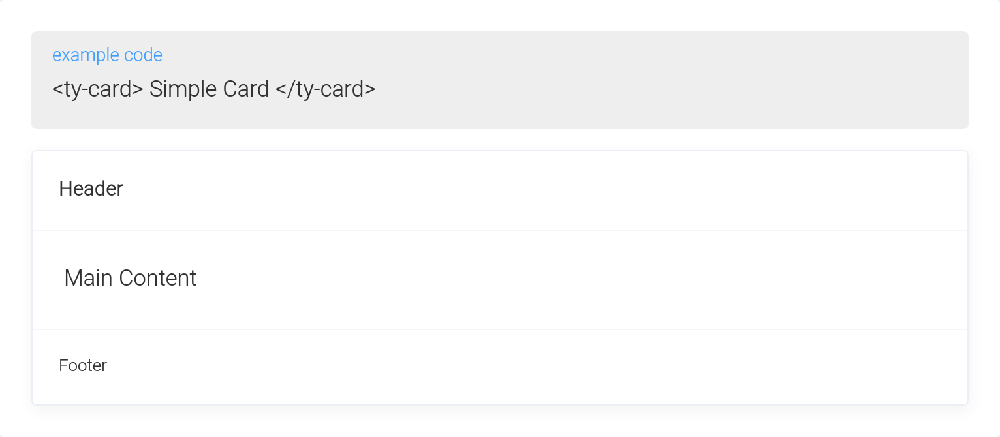
#### Border
```html
    <ty-border>Border Content</ty-border>
```
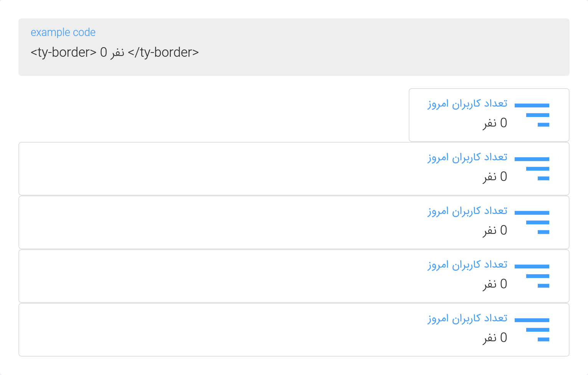
#### Border
```html
    <p class="of-text-ellipsis">Very Long Text That should be truncated</p>
```
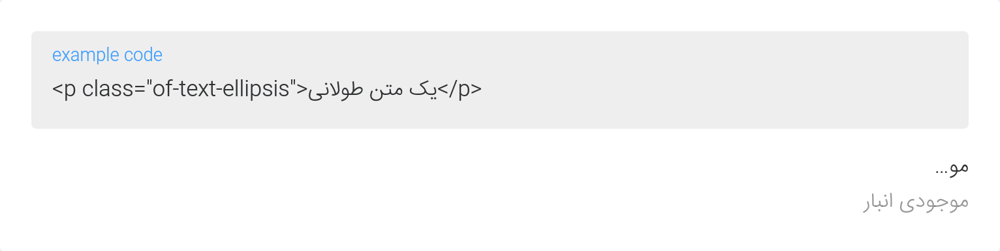
#### Border
```html
    <div v-loading="stillLoading">Content That shoud wait for loading</div>
```
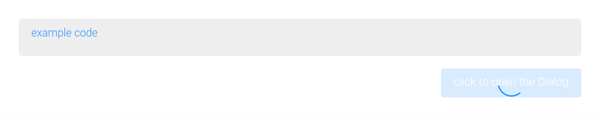
#### Color Picker
```html
    <ty-color-picker v-model="color" @change="handleChange"></ty-color-picker>
    <ty-color-circle v-model="color" editable></ty-color-circle>
```
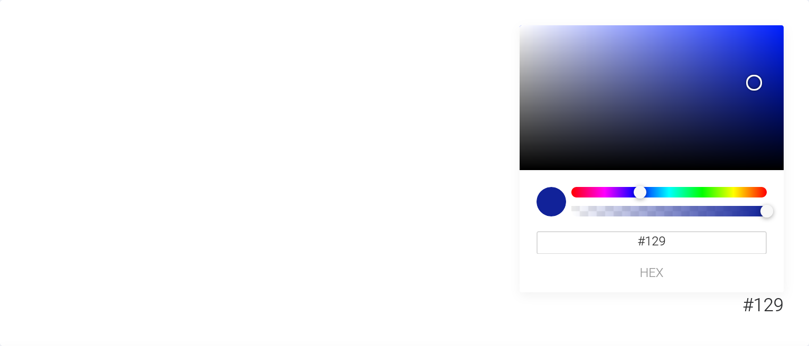
#### Container
```html
    <ty-container>
        <ty-header>Header</ty-header>
        <ty-container>
            <ty-aside>Aside</ty-aside>
            <ty-main>Main</ty-main>
        </ty-container>
    </ty-container>
```
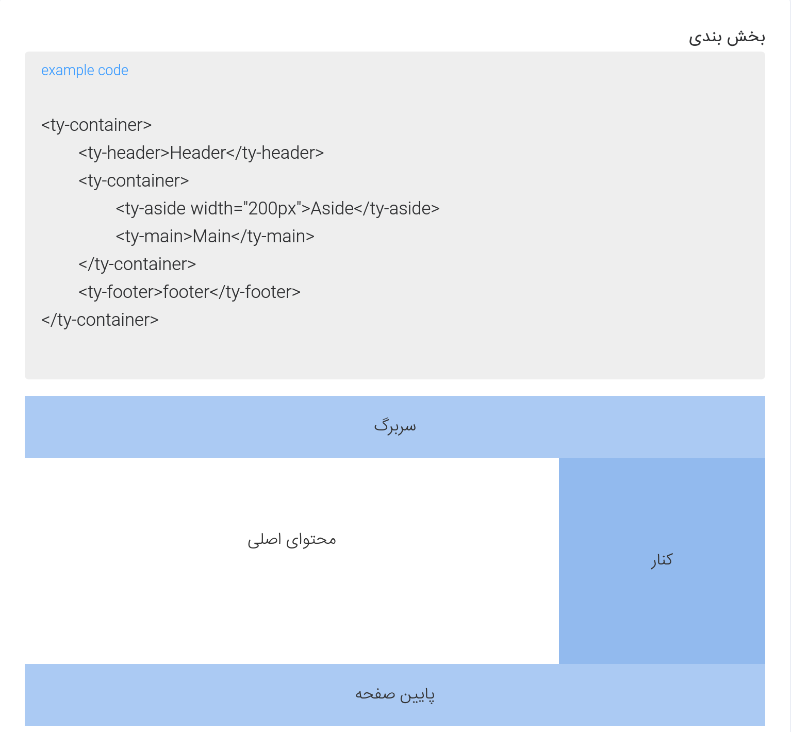
#### Tabs
```html
    <ty-tabs>
        <ty-tab id="tab-1" name="Tab 1">Tab 1 Content</ty-tab>
        <ty-tab id="tab-2" name="Tab 2">Tab 2 Content</ty-tab>
        <ty-tab id="tab-3" name="Tab 3">Tab 3 Content</ty-tab>
    </ty-tabs>
```
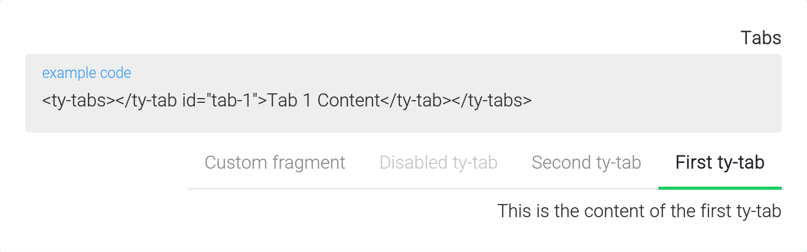